# OCRAutoScore

此仓库为大创集成仓库的README介绍资料。仓库用于将各模块按照流程图一个个完成，并留下输入输出相关接口、文档。README用于说明此项目的原理、实现方式、复现方法等。

GitHub仓库地址：[https://github.com/vkgo/OCRAutoScore](https://github.com/vkgo/OCRAutoScore)

## 1 总流程图

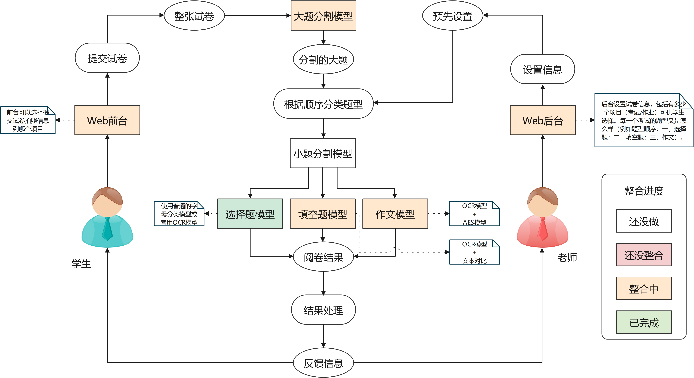

## 2 模块开发规范

示例，如`scoreblocks/fillblankmodel.py`文件一样，写一个类，实际操作中，我们实例化这个类，然后在这个类的`init`中加载各使用到的模型（后面就不用每次调用都要加载了），然后使用类中各个成员函数来实现功能。而py文件中的`if __name__ == "__main__":`可以用来测试用。类、函数的注释中英文都行。

```python
import paddleocr
import numpy as np
from PIL import Image
import torch
from transformers import CLIPProcessor, CLIPModel

debug = False

class model:
    def __init__(self, language:str="en"):
        """
        :parameter language: the language of the text, `ch`, `en`, `french`, `german`, `korean`, `japan`, type: str
        """
        self.ocr = paddleocr.PaddleOCR(use_angle_cls=True, lang=language)
        self.device = torch.device("cuda" if torch.cuda.is_available() else "cpu")
        self.clip_model = CLIPModel.from_pretrained("openai/clip-vit-large-patch14").to(self.device)
        self.clip_processor = CLIPProcessor.from_pretrained("openai/clip-vit-large-patch14", device=self.device)

    def recognize_text(self, _img:Image):
        """
        Predict the text from image
        :parameter img: image, type: np.ndarray
        :return: result, type: tuple{location: list, text: str}
        """
        img = np.array(_img)
        result = self.ocr.ocr(img)
        if debug:
            print(result)
        if len(result[0]) == 0:
            return None
        else:
            location = result[0][0][0]
            text = result[0][0][1][0]
            return (location, text)

    def judge_with_clip(self, _answer:str, _predict:str, _img:Image):
        """
        Use clip to judge which one is more similar to the Image
        :parameter answer: the answer text, type: str
        :parameter predict: the predict text, type: str
        :parameter img: image, type: np.ndarray
        :return: result, the index of the more similar text, type: int
        """
        image = _img
        inputs = self.clip_processor(text=[f"A picture with the text \"{_answer}\"", f"A picture with the text \"{_predict}\"",
                                 "A picture with the other text"], images=image, return_tensors="pt", padding=True)
        inputs.to(self.device)

        outputs = self.clip_model(**inputs)
        logits_per_image = outputs.logits_per_image  # this is the image-text similarity score
        probs = logits_per_image.softmax(dim=1)  # we can take the softmax to get the label probabilities
        if debug:
            print(probs)
        index = torch.argmax(probs, dim=1)
        return index

if __name__ == "__main__":
    """
    用于测试函数
    """
    debug = True
    import paddle
    print(paddle.device.is_compiled_with_cuda())
    model = model()
    while True:
        img_path = input("请输入图片路径: ")
        answer = input("请输入正确答案: ")
        img = Image.open(img_path)
        predict = model.recognize_text(img)[1]
        print("预测结果: ", predict)
        if (predict != answer):
            print("正确结果：", answer)
            index = model.judge_with_clip(answer, predict, img)
            print("判断结果: ", (answer, predict, "error")[index])
```

## 3 文件目录说明

```shell
OCRAutoScore
+----scoreblocks # 填空题、选择题、作文的批改模型文件夹
|    CharacterRecognition
|    |    +----SpinalVGG.pth # SpinalVGG模型
|    |    +----WaveMix.pth # WaveMix模型
|    |    +----example # 测试图片
|    fillblank_testdata # 填空题测试图片
|    MSPLM # AES模型 
|    +----essayscoremodel.py # 作文评分模型
|    +----fillblankmodel.py # 填空题批改模型
|    +----singleCharacterRecognition.py # 单字母识别模型
+----score_web # 前端网页文件夹
|    | components # 前端组件
|    | pages # 页面
|    | routes # 路由
+----score_server # 后端文件夹
|    |  index
|    +----models.py # 数据库模型
|    +----urls.py # 接口文件
|    +----views.py # 视图处理函数
+----CAN # 共识识别 CAN模型的部分依赖
+----README.assets # README的图片文件夹
+----README.md # 仓库说明文件
+----.gitignore # git忽略的文件夹、文件
```

# 4 作答区域分割-大题分割

在大题分割部分，我们使用了YOLOv8模型，通过使用老师提供的数据集进行训练，最终呈现了十分完美的效果。

## 4.1 YOLOv8


YOLOv8是一个包括了图像分类、Anchor-Free物体检测和实例分割的高效算法，检测部分设计参考了目前大量优异的最新的YOLO改进算法，实现了新的SOTA。YOLOv8抛弃了前几代模型的Anchor-Base，是一种基于图像全局信息进行预测的目标检测系统。

与前代相比，YOLOv8有以下不同：

1. 提供了全新的SOTA模型，包括具有P5 640和P6 1280分辨率的目标检测网络以及基于YOLACT的实例分割模型。与YOLOv5类似，还提供了不同大小的N/S/M/L/X比例模型，根据缩放系数来满足不同场景需求。

2. 骨干网络和Neck部分可能参考了YOLOv7 ELAN的设计思路。在YOLOv5中，C3结构被替换为具有更丰富梯度流动性的C2f结构。对于不同比例模型进行了不同通道数量调整，并经过精心微调而非盲目应用一组参数到所有模型上，大大提高了模型性能。然而，在这个C2f模块中存在一些操作（如Split）并不像之前那样适合特定硬件部署。

3. 与YOLOv5相比，在Head部分进行了重大改变，采用主流解耦头结构将分类和检测头分离，并从Anchor-Based转向Anchor-Free。

4. 在损失计算策略方面，采用TaskAlignedAssigner正样本分配策略以及引入Distribution Focal Loss。

5. 在训练过程中进行数据增强时，引入自YOLOX关闭Mosaic增强操作后10个epoch可以有效提高准确性。

YOLOv8作为一种实时目标检测算法，可能被应用于多种场景，包括但不限于：

- 无人驾驶汽车：实时检测道路上的行人、车辆、交通信号等目标，为自动驾驶系统提供关键信息。
- 视频监控：实时检测和跟踪安全系统中的异常行为，如闯入、偷窃等。
- 工业自动化：用于产品质量检测、机器人导航等领域。
- 无人机航拍：实时目标检测和跟踪，为无人机提供导航和避障能力。

此处，我们将其应用于大题分割，也就是，在我们提供的整张试卷中，找到对应的大题（如：客观题、填空题、主观题等）。

## 4.2 单独执行大题分割

大题分割源码在`segmentation/Layout4Card`，也可以通过[URL](https://github.com/vkgo/OCRAutoScore/blob/3a97c0bd2b32abdeaba7c7c0bfa5106bdaee4479/segmentation/Layout4Card)进入我们仓库中大题分割的目录查看、复制、运行，需要更多的支持，[可以查看文档](https://github.com/vkgo/OCRAutoScore/blob/aeefed4426e3088507e709cfd3cb99c891f44af2/segmentation/Layout4Card/README.md)。

`infer.py`是一个推理代码的示范，在这之中：

1. CLS_ID_NAME_MAP是一个字典，里面有我们支持的识别类别和它对应的index。
2. model是载入模型，此处可以使用我们训练好的模型不需要改动。
3. folder是将要测试的图片的目录，可以换为测试图片。
4. 运行后，由于`model.predict(source=imgs, save=True, imgsz=640)`中的`save=True`，文件将被村粗在`segmentation/Layout4Card/run`目录之下。

```python
CLS_ID_NAME_MAP = {
    0: 'student_id',
    1: 'subjective_problem',
    2: 'fillin_problem',
    3: 'objective_problem'
}

model = YOLO(model='./runs/detect/train3/weights/best.pt')
folder = './testdata'
file_names = os.listdir(folder)

random.shuffle(file_names)

imgs = []
for file_name in file_names[:10]:
    img_path = os.path.join(folder, file_name)
    img = cv2.imread(img_path)
    imgs += [img]
results =  model.predict(source=imgs, save=True, imgsz=640)
```

## 4.3 样例

```shell
cd .\segmentation\Layout4Card\
python .\infer.py
```


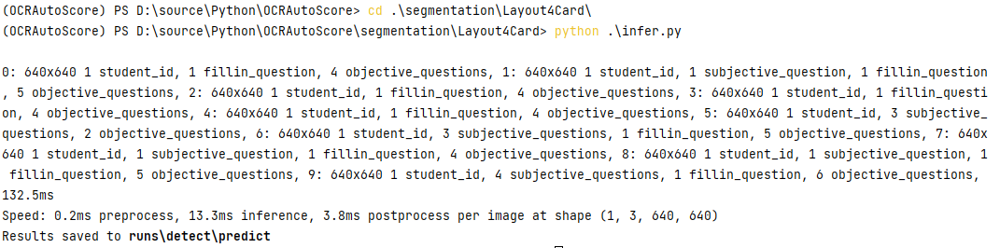

保存的图片如下：：

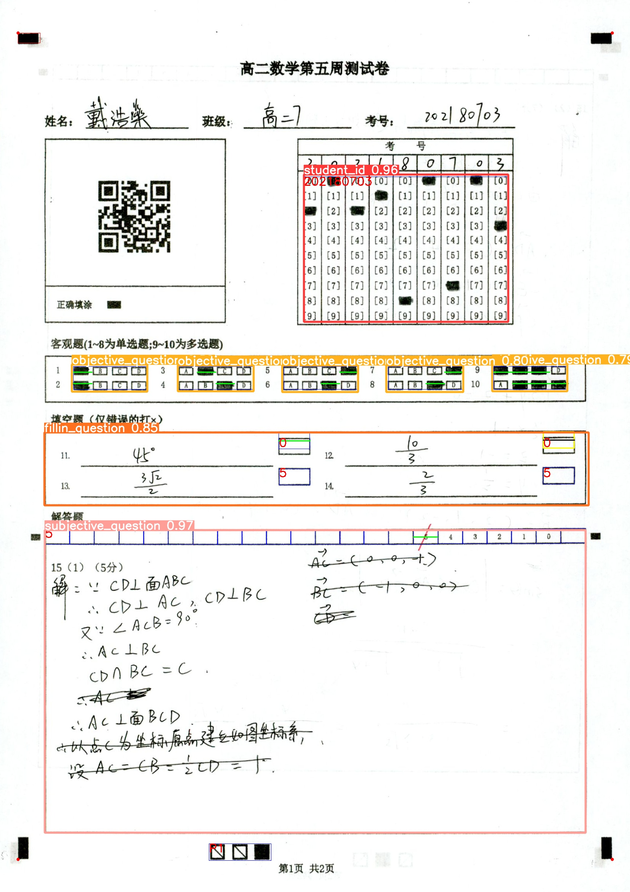


# 5 作答区域分割-小题分割

## 5.1 工具

`opencv-python 4.5.5.62`

## 5.2 具体实现

### (1) 图片预处理

将输入的填空题图片处理成二值图片

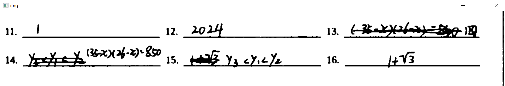

### (2) 保留水平线

对二值图片进行腐蚀处理，保留图片中的水平线，其余不相关的笔迹
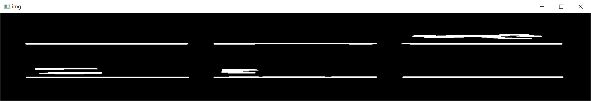

### (3) 消除干扰的水平线

对所有水平线的位置进行排序，排序法则为垂直方向降序，水平方向升序。根据上图排序结果如下：
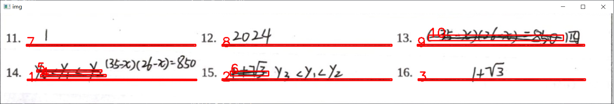

遍历所有定位，获取当前的水平线（在此水平线被视为宽度小于长度的矩形，每条边的存储形式为[x,y,w,h]）的位置(x, y)，并标记当前的y坐标，给定hmin与hmax，设置高度范围限制(y - hmax,y - hmin)，记录处于该范围的定位，若遇见范围外的，更新y坐标和高度限制。
遍历结束后将标记的目标移除，剩下的即为检测目标。

最后再进行升序排序，进行遍历。得到检测的效果如下所示：
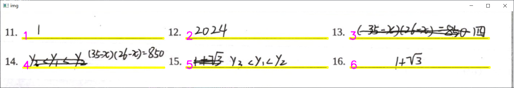


## 5.3 使用说明

```commandline
cd segmentation/blankSegmentation
python blank_segmentation.py
```

根据提示输入识别的文件夹路径，确定Debug模式

在Debug模式下会在debug文件夹中输出扫描结果，如样例所示：


# 6 选择题模型

## 6.1 数据集

使用EMNIST数据集的letters部分，该部分只包含手写字母数据，适合作为选择题单字母模型数据集。

## 6.2 模型框架

### 6.2.1 SpinalNet模型

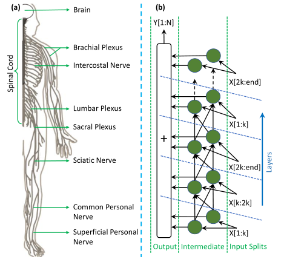

模型参考地址：`https://github.com/dipuk0506/SpinalNet`

该神经网络模拟的是人体的躯体感觉系统。该神经网络的特点主要有：神经丛结构（体现在中间层），全局影响与局部输出等。

神经网络模型流向：输入层->中间层->输出层

中间子层接收输入的方向有输入层和前一个中间子层的输入。

### 6.2.2 WaveMix模型

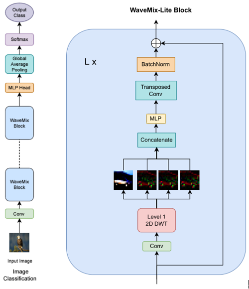

模型参考地址：`https://github.com/pranavphoenix/WaveMix`

WaveMix模型主要利用2D离散小波变换(DWT)对空间特征进行混合，无需展开图像与自我注意力机制，利用自身图像的2D结构来提高泛化能力。


## 6.3 模型实现

### 6.3.1 SpinalNet模型

输入层先将输入的数据传入卷积层提取特征，提取的特征分成几个部分，传入不同的中间层，最后将特征合并，经过线性层输入分类结果。

### 6.3.2 WaveMix模型

图像首先经过卷积层，再进入一系列WaveMix块（WaveMix块里主要做离散小波变换，再按序传到具有GELU的MLP层、转置卷积层与BatchNorm层），之后进入MLP Head，再通过全局平均池化层得到分类输出层。

## 6.4 模型训练

模型训练地址：`https://github.com/YouHui1/Character_Recognition`

```commandline
python train.py -k number
```

`number == 1` 时选择`SpinalNet`模型，
`number == 2` 时选择`WaveMix`模型

训练前可在`config.py`里修改模型类型，训练轮数，学习率，batchsize等等。

训练完毕后，训练日志存储在`log`文件夹中，模型参数存储在`param`文件夹中

## 6.4 模型使用说明

将训练后的模型参数保存在某一路径中（本项目保存在`CharacterRecognition`文件夹中）

运行`singleCharacterRecognition.py`文件，根据提示输入识别单字母图片的文件夹路径，输出为字母识别结果


# 7 填空题模型-中英文识别

中英文识别部分，我们使用PaddlePaddleOCR+Clip来实现识别+评判的中英文填空题批改。

## 7.1 PaddlePaddleOCR

PaddlePaddleOCR是一个基于PaddlePaddle深度学习框架的免费、开源的OCR（Optical Character Recognition，光学字符识别）项目。它由百度开源并持续维护。PaddlePaddleOCR旨在提供一个易于使用、高性能、多语言支持的OCR解决方案。

该项目结合了最新的深度学习技术和实际应用需求，致力于为开发者提供一个简单易用、功能强大的OCR工具库。其支持的场景包括但不限于印刷体、手写体、场景文本的识别等。

### 7.1.1 选择PPOCR的原因

PaddlePaddleOCR在许多OCR竞赛中取得了优异的成绩，表现出了良好的泛化能力和性能。它被广泛应用于包括智能办公、金融、医疗、教育等多个领域。

PaddlePaddleOCR具有以下主要功能与特性：

1. 多任务支持：PaddlePaddleOCR支持多种OCR任务，包括文本检测、方向分类、文本识别等，可灵活应对各种场景。
2. 多语言支持：项目支持多种语言的识别，包括英文、中文、法文、德文、日文等，适用于国际化场景。
3. 易于使用：PaddlePaddleOCR提供了丰富的API接口和预训练模型，开发者可以快速上手并实现自定义需求。
4. 高性能：项目结合了最新的深度学习技术，包括卷积神经网络（CNN）和长短时记忆网络（LSTM），确保了较高的识别准确率和性能。
5. 实时性：PaddlePaddleOCR在保证识别准确率的同时，关注实时性，可以满足实时场景下的OCR需求。

通过这些功能与特性，PaddlePaddleOCR为开发者提供了一个高效、易用、可扩展的OCR解决方案，是我们调研之后，**对中文手写字体识别最好的一个开源项目**。

### 7.1.2 PPOCR的基本结构

PaddlePaddleOCR的项目架构主要包括以下几个部分：

1. 文本检测：文本检测模块负责在图像中定位文本区域。PaddlePaddleOCR提供了多种检测算法，如DB（Differentiable Binarization）、EAST（Efficient and Accurate Scene Text Detector）等，以满足不同场景下的检测需求。
2. 方向分类：方向分类模块用于判断检测到的文本区域的方向，主要针对旋转文本进行处理。这有助于将文本区域校正到统一方向，为后续的文本识别做好准备。
3. 文本识别：文本识别模块负责从校正后的文本区域中提取文本信息。PaddlePaddleOCR采用了CRNN（Convolutional Recurrent Neural Network）等先进算法进行文本识别，以实现高准确率的字符识别。
4. 模型训练与优化：PaddlePaddleOCR提供了丰富的预训练模型和训练脚本，支持用户根据自己的数据集进行模型训练。此外，项目还提供了模型优化工具，帮助用户在保持准确率的同时，降低模型复杂度，提高推理速度。
5. 推理部署：PaddlePaddleOCR支持多种部署方式，包括Python API、C++ API和服务端部署。项目提供了易用的部署工具和教程，使得OCR功能能够方便地集成到各种应用中。
6. 工具与API：PaddlePaddleOCR提供了多种工具和API，帮助用户快速上手项目并实现自定义功能。例如，项目提供了可视化工具，方便用户对检测与识别结果进行分析。

这个架构确保了PaddlePaddleOCR可以适应不同场景的文本识别需求，同时易于开发者使用和定制。


### 7.1.3 预训练模型

PaddlePaddleOCR提供了多种预训练模型，以便用户可以根据自己的需求选择合适的模型。这些预训练模型涵盖了不同的文本检测和识别算法，包括以下几种：

1. 文本检测预训练模型：PaddlePaddleOCR为不同的文本检测算法提供了预训练模型。例如，DB（Differentiable Binarization）和EAST（Efficient and Accurate Scene Text Detector）等。
2. 方向分类预训练模型：项目提供了方向分类预训练模型，用于判断检测到的文本区域的方向。
3. 文本识别预训练模型：PaddlePaddleOCR为文本识别任务提供了多种预训练模型，如CRNN（Convolutional Recurrent Neural Network）等。这些模型支持多种语言，如英文、中文、日文等。

这些预训练模型为开发者提供了一个很好的起点，用户可以基于这些模型进行微调（Fine-tuning），以便适应自己的任务和数据集。在实际应用中，选择合适的预训练模型可以大大减少模型训练时间，并提高模型性能。

预训练模型可以到百度[PaddlePaddle的仓库](https://github.com/PaddlePaddle/PaddleOCR)中进行下载，下面转自PaddlePaddle仓库，我们使用的是`English ultra-lightweight PP-OCRv3 model`、`Chinese and English ultra-lightweight PP-OCRv3 model（16.2M）`这两个轻量化模型。

| Model introduction                                           | Model name              | Recommended scene | Detection model                                              | Direction classifier                                         | Recognition model                                            |
| ------------------------------------------------------------ | ----------------------- | ----------------- | ------------------------------------------------------------ | ------------------------------------------------------------ | ------------------------------------------------------------ |
| Chinese and English ultra-lightweight PP-OCRv3 model（16.2M） | ch_PP-OCRv3_xx          | Mobile & Server   | [inference model](https://paddleocr.bj.bcebos.com/PP-OCRv3/chinese/ch_PP-OCRv3_det_infer.tar) / [trained model](https://paddleocr.bj.bcebos.com/PP-OCRv3/chinese/ch_PP-OCRv3_det_distill_train.tar) | [inference model](https://paddleocr.bj.bcebos.com/dygraph_v2.0/ch/ch_ppocr_mobile_v2.0_cls_infer.tar) / [trained model](https://paddleocr.bj.bcebos.com/dygraph_v2.0/ch/ch_ppocr_mobile_v2.0_cls_train.tar) | [inference model](https://paddleocr.bj.bcebos.com/PP-OCRv3/chinese/ch_PP-OCRv3_rec_infer.tar) / [trained model](https://paddleocr.bj.bcebos.com/PP-OCRv3/chinese/ch_PP-OCRv3_rec_train.tar) |
| English ultra-lightweight PP-OCRv3 model（13.4M）            | en_PP-OCRv3_xx          | Mobile & Server   | [inference model](https://paddleocr.bj.bcebos.com/PP-OCRv3/english/en_PP-OCRv3_det_infer.tar) / [trained model](https://paddleocr.bj.bcebos.com/PP-OCRv3/english/en_PP-OCRv3_det_distill_train.tar) | [inference model](https://paddleocr.bj.bcebos.com/dygraph_v2.0/ch/ch_ppocr_mobile_v2.0_cls_infer.tar) / [trained model](https://paddleocr.bj.bcebos.com/dygraph_v2.0/ch/ch_ppocr_mobile_v2.0_cls_train.tar) | [inference model](https://paddleocr.bj.bcebos.com/PP-OCRv3/english/en_PP-OCRv3_rec_infer.tar) / [trained model](https://paddleocr.bj.bcebos.com/PP-OCRv3/english/en_PP-OCRv3_rec_train.tar) |
| Chinese and English ultra-lightweight PP-OCRv2 model（11.6M） | ch_PP-OCRv2_xx          | Mobile & Server   | [inference model](https://paddleocr.bj.bcebos.com/PP-OCRv2/chinese/ch_PP-OCRv2_det_infer.tar) / [trained model](https://paddleocr.bj.bcebos.com/PP-OCRv2/chinese/ch_PP-OCRv2_det_distill_train.tar) | [inference model](https://paddleocr.bj.bcebos.com/dygraph_v2.0/ch/ch_ppocr_mobile_v2.0_cls_infer.tar) / [trained model](https://paddleocr.bj.bcebos.com/dygraph_v2.0/ch/ch_ppocr_mobile_v2.0_cls_train.tar) | [inference model](https://paddleocr.bj.bcebos.com/PP-OCRv2/chinese/ch_PP-OCRv2_rec_infer.tar) / [trained model](https://paddleocr.bj.bcebos.com/PP-OCRv2/chinese/ch_PP-OCRv2_rec_train.tar) |
| Chinese and English ultra-lightweight PP-OCR model (9.4M)    | ch_ppocr_mobile_v2.0_xx | Mobile & server   | [inference model](https://paddleocr.bj.bcebos.com/dygraph_v2.0/ch/ch_ppocr_mobile_v2.0_det_infer.tar) / [trained model](https://paddleocr.bj.bcebos.com/dygraph_v2.0/ch/ch_ppocr_mobile_v2.0_det_train.tar) | [inference model](https://paddleocr.bj.bcebos.com/dygraph_v2.0/ch/ch_ppocr_mobile_v2.0_cls_infer.tar) / [trained model](https://paddleocr.bj.bcebos.com/dygraph_v2.0/ch/ch_ppocr_mobile_v2.0_cls_train.tar) | [inference model](https://paddleocr.bj.bcebos.com/dygraph_v2.0/ch/ch_ppocr_mobile_v2.0_rec_infer.tar) / [trained model](https://paddleocr.bj.bcebos.com/dygraph_v2.0/ch/ch_ppocr_mobile_v2.0_rec_train.tar) |
| Chinese and English general PP-OCR model (143.4M)            | ch_ppocr_server_v2.0_xx | Server            | [inference model](https://paddleocr.bj.bcebos.com/dygraph_v2.0/ch/ch_ppocr_server_v2.0_det_infer.tar) / [trained model](https://paddleocr.bj.bcebos.com/dygraph_v2.0/ch/ch_ppocr_server_v2.0_det_train.tar) | [inference model](https://paddleocr.bj.bcebos.com/dygraph_v2.0/ch/ch_ppocr_mobile_v2.0_cls_infer.tar) / [trained model](https://paddleocr.bj.bcebos.com/dygraph_v2.0/ch/ch_ppocr_mobile_v2.0_cls_train.tar) | [inference model](https://paddleocr.bj.bcebos.com/dygraph_v2.0/ch/ch_ppocr_server_v2.0_rec_infer.tar) / [trained model](https://paddleocr.bj.bcebos.com/dygraph_v2.0/ch/ch_ppocr_server_v2.0_rec_train.tar) |


## 7.2 Clip

Clip是由OpenAI开发的一种具有高级视觉和语言理解能力的人工智能模型。该项目旨在创建一个能够理解图像内容并将其与自然语言描述相结合的AI系统。Clip实现了计算机视觉与自然语言处理的融合，为多种任务提供了强大的性能。

Clip的名字来源于“Contrastive Language-Image Pretraining”，表明这个模型是通过在大量文本和图像数据上进行预训练，学习将语言和图像信息联系起来的方法。这使得Clip具有诸如图像分类、生成文本描述以及从文本描述生成图像等功能。Clip的核心目标是通过将视觉和语言的理解结合在一起，实现更智能、更灵活的AI应用。

### 7.2.1 选择Clip的原因

Clip模型的基础是基于Transformer架构，将计算机视觉（CV）与自然语言处理（NLP）技术相结合。它通过使用大量的图像-文本对进行预训练，学会了如何将图像和自然语言联系在一起。

在训练过程中，Clip使用了一种名为对比学习（contrastive learning）的方法。对比学习的关键在于让模型学会区分和关联正确的图像-文本对，同时抑制不相关的组合。具体来说，模型需要将正例（匹配的图像-文本对）与负例（不匹配的图像-文本对）进行区分，并通过优化过程来提高正例的相似度，同时降低负例的相似度。

训练完成后，Clip可以执行多种任务，如图像分类、文本到图像生成等。在执行这些任务时，Clip会计算给定的图像与自然语言描述之间的相似度。例如，在进行图像分类任务时，Clip会计算输入图像与每个类别的文本描述之间的相似度，并选择与输入图像最相似的类别作为预测结果。

Clip不仅可以处理预先定义好的分类任务，还可以在不进行额外训练的情况下，灵活处理用户提供的自然语言查询。这使得Clip在计算机视觉和自然语言处理领域具有很强的通用性和可扩展性。

**而我们的填空题识别，如果但用CV的方式，可能会导致识别的准确率过低，而因为我们本身是可以知道填空题答案的，此时，结合填空题答案的语意和学生作答手写体图片的语意，可以达到二次检查，将准确率大大提升（经过我们少数样本的测试，准确率已知的是100%）。**

### 7.2.2 Clip的基本结构

Clip模型的基本结构由两个主要部分组成：一个是视觉编码器（Visual Encoder），另一个是文本编码器（Text Encoder）。这两个编码器都基于Transformer架构，使得模型能够同时处理图像和自然语言数据。

1. 视觉编码器：视觉编码器的任务是将输入图像转换成具有高层次特征表示的向量。这通常通过使用类似于ViT（Vision Transformer）的模型来完成。ViT模型将输入图像分割成多个小块，然后将每个小块展平并线性嵌入为一个向量。这些向量被送入Transformer层进行编码，最终输出一个表示整个图像的向量。
2. 文本编码器：文本编码器使用类似于BERT或GPT这样的预训练Transformer模型来处理自然语言。文本编码器接收一个文本序列（例如单词或字）作为输入，并将其转换为一个高维向量。这个向量包含了输入文本中的语义信息。

Clip通过将视觉编码器和文本编码器联合训练，学会了将图像和自然语言联系起来。这是通过对比学习来实现的，在训练过程中，Clip需要区分正确的图像-文本对（正例）和错误的图像-文本对（负例），并优化这两类对之间的相似度。

### 7.2.3 预训练模型

在预训练阶段，Clip模型使用大量的图像-文本对数据进行训练，以学会将视觉信息与自然语言信息关联起来。这些数据集通常包括多个领域的图像，如互联网中的图片、艺术品、卫星图像等，以及与这些图像相关的文本描述。这样的数据集可以帮助模型在训练过程中捕捉到丰富的视觉和语言知识。

预训练的目标是通过对比学习来教会Clip如何区分正确的图像-文本对（正例）和错误的图像-文本对（负例）。训练过程中，Clip需要学会提高正例之间的相似度，同时降低负例之间的相似度。为了实现这一目标，Clip在预训练阶段使用了一种称为“对比损失函数”（contrastive loss function）的优化方法。

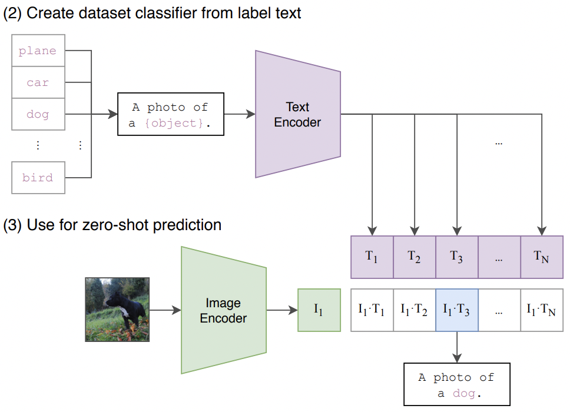

通过这样的预训练，Clip学会了如何将图像和文本表示为相似度空间中的向量，使得相关的图像和文本向量在这个空间中靠近，而不相关的图像和文本向量则远离。这使得Clip具有了处理视觉和语言任务的能力，例如图像分类、文本生成以及文本到图像生成等。

在预训练完成之后，Clip可以直接应用于多种任务，而无需进行任务特定的微调。这使得Clip在计算机视觉和自然语言处理领域具有很强的通用性和可扩展性。

在我们的项目中，使用Hugging Face上的`openai/clip-vit-large-patch14`预训练模型的权重。


## 7.3 PPOCR + Clip 在填空题模型的应用

我们以前使用的模型是paddleOCR，它对写的较清晰的图片有很好的识别效果，但是，如果图片分辨率很差或者连笔、不清晰之类的情况出现，则很有可能出错，如下：


这个单词为“nationally”，但由于分辨率、连笔，OCR是被为"rationally"。

这个星期我想到了一个方案，使用paddleOCR + clip进行填空题的判断，伪代码流程如下：

```python
answer = getanswer() # 获取正确答案
predict = paddleocr(img) # 通过OCR获取预测的文本
if (answer == predict):
    <正确>
else:
    prompt_1 = "A picture with the text \"{answer}\""
    prompt_2 = "A picture with the text \"{predict}\""
    prompt_other = "A picture with the other text"
    output = clip(prompt_1, prompt_2, prompt_other, img)
    if (output == 0): # 第一个文本概率最大
        <正确>
    else:
        <错误>
```

总的来说，就是使用clip在ocr模型之后当一个质检员，如果预测结果和答案不一样，那我们就让clip来判断，predict和answer两个字符串哪个和图片最接近。

根据我个人测试，由于没有数据集，自己手写了9张低分辨率、易混淆的英文单词图片，单独采用paddleocr只有3/9的正确率，使用paddleocr + clip有9/9的正确率。鉴于这是很极限的测试，个人认为paddleocr + clip可满足实际用途。

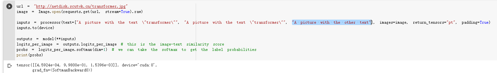


## 7.4 样例

可以前往项目目录的`scoreblocks/fillblankmodel.py`中单独运行我们的PPOCR + Clip 填空题模型，也可以前往仓库填空题模型的[URL](https://github.com/vkgo/OCRAutoScore/blob/cb5c9c3e9ab7eeefeb992fda474ca7ebbc4b2c43/scoreblocks/fillblankmodel.py)进行查看，我们模型的部分源码如下：

```python
class model:
    def __init__(self, language:str="en"):
        """
        :parameter language: the language of the text, `ch`, `en`, `french`, `german`, `korean`, `japan`, type: str
        """

    def recognize_text(self, _img:Image):
        """
        Predict the text from image
        :parameter img: image, type: np.ndarray
        :return: result, type: tuple{location: list, text: str}
        """

    def judge_with_clip(self, _answer:str, _predict:str, _img:Image):
        """
        Use clip to judge which one is more similar to the Image
        :parameter answer: the answer text, type: str
        :parameter predict: the predict text, type: str
        :parameter img: image, type: np.ndarray
        :return: result, the index of the more similar text, type: int
        """

if __name__ == "__main__":
    """
    用于测试函数
    """
    debug = True
    import paddle
    print(paddle.device.is_compiled_with_cuda())
    model = model()
    while True:
        img_path = input("请输入图片路径: ")
        answer = input("请输入正确答案: ")
        img = Image.open(img_path)
        predict = model.recognize_text(img)[1]
        print("预测结果: ", predict)
        if (predict != answer):
            print("正确结果：", answer)
            index = model.judge_with_clip(answer, predict, img)
            print("判断结果: ", (answer, predict, "error")[index])
```

我们运行后仅需要输入要检测的图片的路径还有正确答案即可进行批改。

如何运行：

```shell
cd .\scoreblocks\
python .\fillblankmodel.py
```

测试图片：


运行结果：

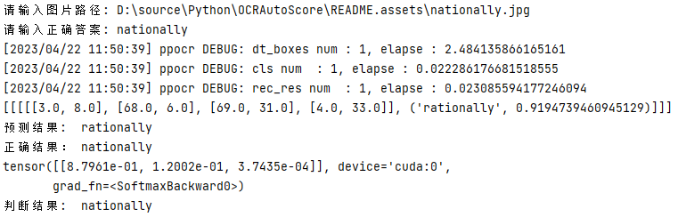

可见，PPOCR将其预测为`rationally`，而我们的Clip模型在`rationnally`和`nationally`的选择之下，最终选择了`nationally`。


# 8 填空题模型-公式识别
## 8.1 架构

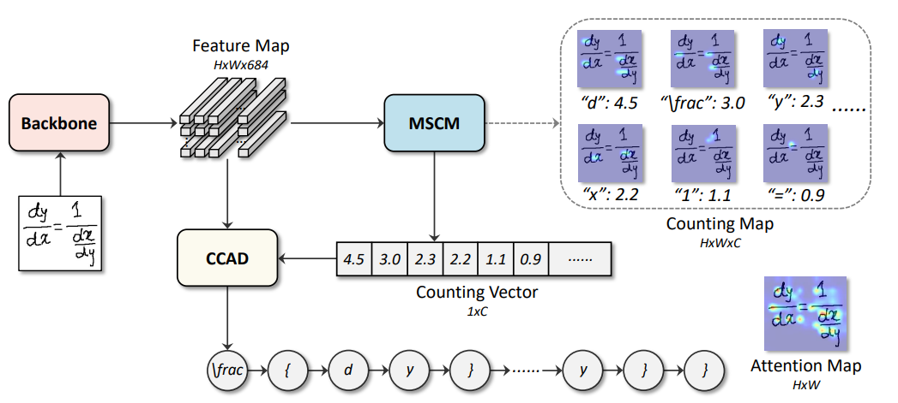
在本项目中，结合了Li B(2022)提出的CAN（计数感知网络），我们实现了对log、e^x等较为复杂的公式的识别。CAN整合了两部分任务：手写公式识别和符号计数。具体来说，使用了一个弱监督的符号计数模块，它可以在没有符号位置的情况下预测每个符号类的数目。

## 8.2 实现

训练部分
    在数学公式识别中，我们参考了CAN(Li B et al)使用的方法，使用注意力机制，结合encoder，decoder的方法，使用DenseNet作为encoder。在训练过程中，我们先将images输入DenseNet得到image的特征，之后，我们将该特征分别输入到预先设置的三个decoder中，前两个decoder生成counting_loss,最后一个decoder生成word_loss，通过三个loss分别训练不同的decoder。
数据集
	我们使用CROHME数据集进行公式的训练。CROHME数据集为pkl文件，我们通过python的PIL库读取该数据集。
预测
	在预测公式的过程中，预先定义一个字典，使用encoder-decoder将预测的概率与字典中的字符匹配，实现手写公式的识别，如下图所示，我们将预先定义的字符映射到字典中。
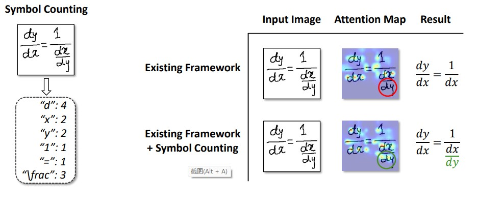

## 8.3 运行

该项目需要pytorch1.10.2+python3.6

training：

```shell
cd scoreblocks/CAN

source activate pytorch

python train --dataset=CROHME
```

test:

```shell
python inference.py
```

# 9 作文评分模型

此处参考NAACL的论文[On the Use of Bert for Automated Essay Scoring: Joint Learning of Multi-Scale Essay Representation - ACL Anthology](https://aclanthology.org/2022.naacl-main.249/)

## 9.1 原模型结构

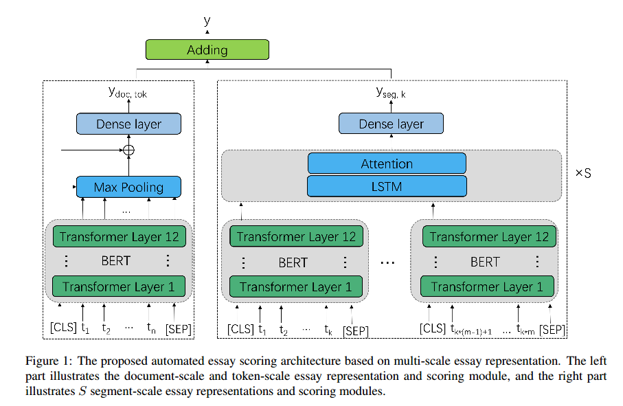

采用了多尺度Bert、多重损失、迁移学习等方法。原模型的仓库为：[lingochamp/Multi-Scale-BERT-AES: Demo for the paper "On the Use of BERT for Automated Essay Scoring: Joint Learning of Multi-Scale Essay Representation" (github.com)](https://github.com/lingochamp/Multi-Scale-BERT-AES)

## 9.2 模型改进

由于原模型为完全开源，许多部分是我们自己完成的，或许是我们的水平有限，在ASAP数据集上并没有作者所说的效果那么好。

经过消融实验之后，我们使用单一的debertav3-large模型代替多尺度 bert-base模型，使用`(0.2+0.8*cos(epoch/total_epoch*pi))MSE + (1-0.8*cos(epoch/total_epoch*pi)))*(RankLoss + CosLoss) `来代替原来的损失函数，由于数据集限制，我们没有使用迁移学习，其他部分也有改动，但不大。

改进后的模型，我们取名为MSPLM，可以前往我们的仓库：[vkgo/MSPLM (github.com)](https://github.com/vkgo/MSPLM)，获取代码、实验结果。


# 10 WebUI
## 10.1 框架

- 前端框架： React + Typescript
    
- 后端框架: Django —— 基于python开发的后端框架
    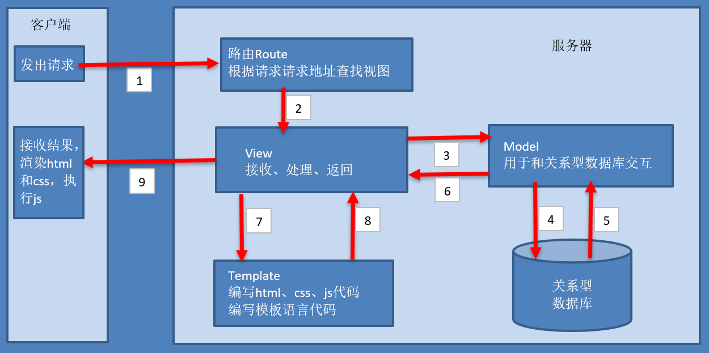

## 10.2 实现

#### 登录注册
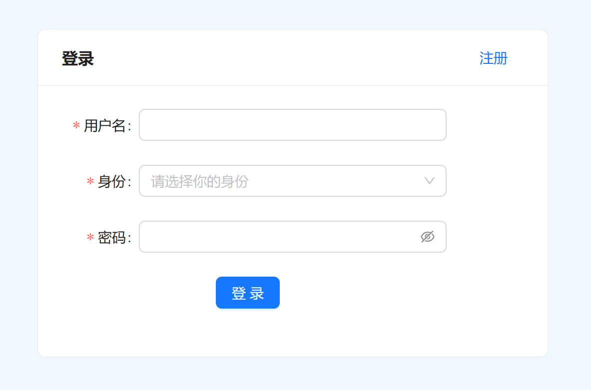
- 前端使用antd组件库Form组件，用户填写表单后，请求后端接口。
- 后端查询Student、Teacher数据表 是否存在对应的数据，如果查询为空, 那么返回错误“用户名或者密码错误”，如果不为空，则返回登录成功的信息
- 如果登录成功，我们将用户信息存入session中

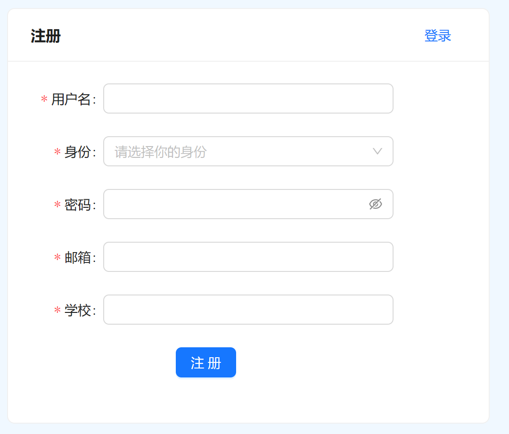
- 前端使用antd组件库Form组件，用户填写表单后，请求后端接口。
- 后端根据username查询Student、Teacher数据表 是否存在对应的数据，如果查询为空, 那么返回“注册成功”，如果不为空，则返回错误“该用户名已经被注册”的信息
- 如果登录成功，我们将用户信息存入session中

#### 试卷列表
试卷列表在学生、教师页面都有出现。在学生界面则是题库，在教师界面则是教师上传过的所有试卷。
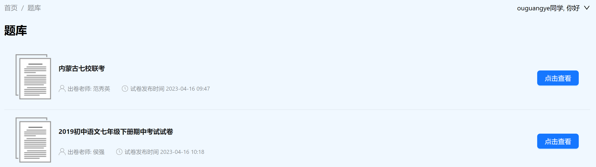

前端请求后端接口，后端查询Paper数据表返回相应信息

#### 教师上传试卷
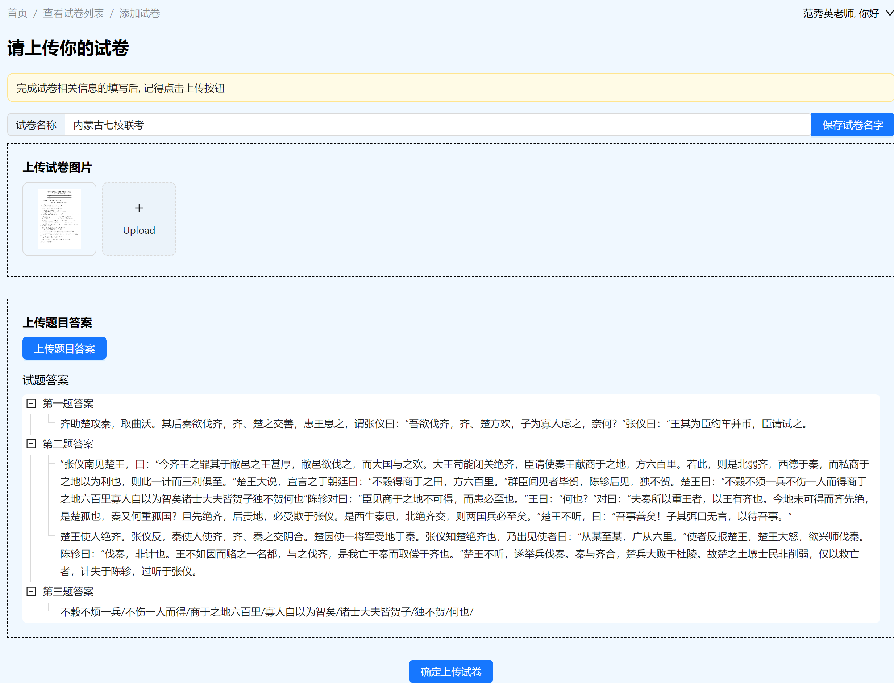
- 刚进入页面时，前端请求创建试卷的接口; 
- 这部分有三个信息： 试卷名字、试卷图片、试卷答案。填入信息后，请求后端相应的接口保存对应的信息。
- 如果用户没有点击保存按钮，那么退出页面后，前端会请求删除试卷的接口
#### 学生上传作答图片
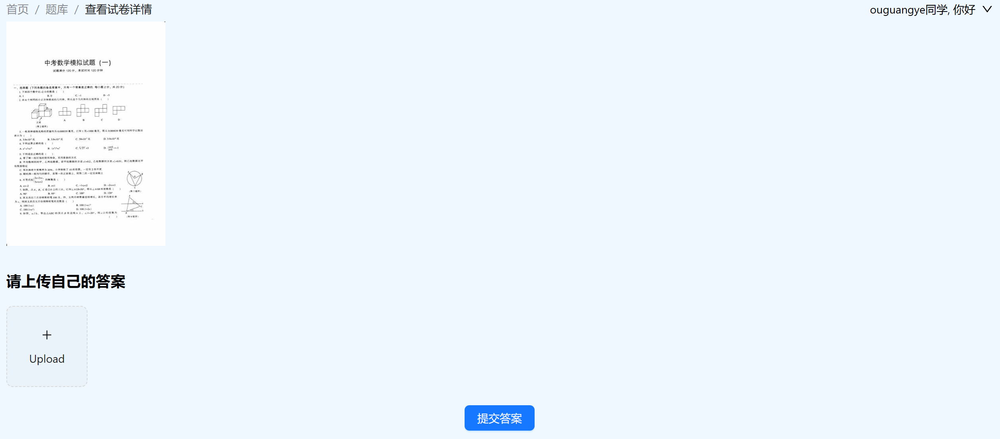
- 刚进入页面时候，前端根据试卷的paperid请求后端，后端返回试卷的图片。
- 学生上传自己作答的图片
- 后端调用*score.py*的模型进行评分，并且返回评分
## 10.3 运行
- 前端运行
    进入score_web文件夹
    ```shell
    npm start
    ```
- 后端运行
    进入score_server文件夹
    ```shell
    python manage.py runserver
    ```

